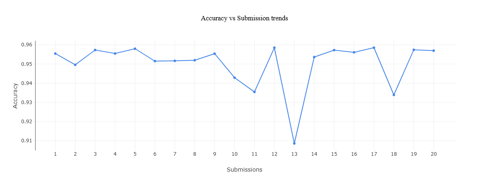

# Shinkansen Passenger Satisfaction - Rank 1 Solution

[cite_start]This repository contains the top-performing architecture for the Shinkansen Passenger Satisfaction Hackathon, held from February 6th - February 8th, 2026[cite: 6]. [cite_start]The provided solution secured the first position [cite: 5] [cite_start]by Rastin Aghighi[cite: 4].

## Performance and Iteration Tracking


*Figure 1: Accuracy vs. Submission trends across 20 experimental iterations.* The submission history visualizes the exploration phase. The variance highlights the testing of different architectures (including multi-model stacking and feature transformations) before converging on the optimal, high-bias CatBoost topology which yielded the peak evaluation metric.

## Core Architecture

The winning model bypasses standard One-Hot Encoding and complex Ensembling in favor of a singular, heavily regularized CatBoost Classifier operating in Native Mode.

* **Algorithm**: CatBoost Classifier
* **Categorical Handling**: Ordered Target Statistics. Raw ordinal strings were passed directly into the model to preserve the ordinal weight of the survey answers and prevent spatial matrix bloat.
* **Hyperparameter Topology**:
  * `depth`: 8. Allows for deeply nested micro-segment identification.
  * `l2_leaf_reg`: 1.96. Aggressive penalization applied to counter the high depth, preventing the tree from memorizing low-frequency outlier data.
  * `learning_rate`: 0.05.
* **Imputation Strategy**: Missing values in categorical features were mapped to an explicit `"Missing_Data"` class. In subjective survey datasets, non-response functions as a distinct behavioral signal. Standard mean or mode imputation actively destroys this signal.

## Repository Structure

* `src/`: Contains the primary inference engine (`solver_native_cat.py`).
* `src/archive/`: Contains deprecated experiments, including alternate models and feature engineering scripts explored during the hackathon lifecycle.
* `data/`: Local directory reserved for the raw competition `.csv` files. Data files are explicitly untracked via `.gitignore` to maintain strict version control compliance.

## Reproduction Steps

1. Clone the repository.
2. Download the raw dataset from the Kaggle competition page.
3. Place all required `.csv` files into the `data/` directory.
4. Execute the primary solver:
   ```bash
   python src/solver_native_cat.py
